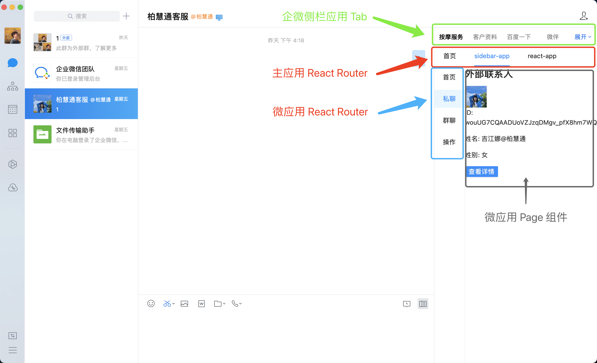
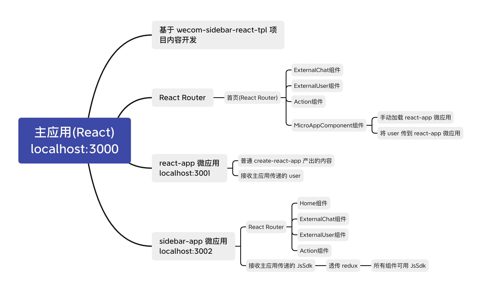
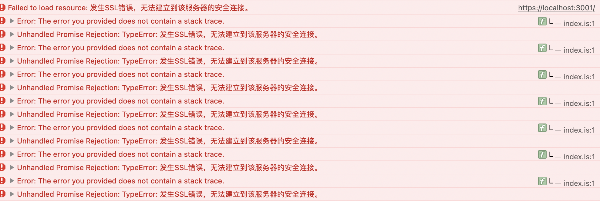

# wecom-sidebar-micro-frontend

此项目为企业微信侧边栏 + qiankun 微前端框架的实践模板。



## 痛点

为什么还要搞一个微前端模板呢？如果开发多个侧边栏应用时，会有以下痛点：

* **所有侧栏应用为硬隔离**。切换不同应用都要重新加载
* **基础信息不共享**。重新加载又需要重新初始化 JS-SDK 和获取群聊、私聊、用户身份的信息，而这些信息对于每个应用都是必需的，不应该每次都重新获取
* **方便多团队协作**。应对已有 H5 嵌入到侧边栏的场景

## 微前端思路

企微侧边栏的配置本质上就是配置 `应用名` 和 `H5  URL`，这和 [qiankun](https://qiankun.umijs.org/zh) 微前端框架注册微应用的方式非常相似！
所以，我就想不如尝试使用 qiankun 注册微应用的试来 "注册侧边栏应用"。

除了正常的微应用注册，我还希望有如下功能：
* 微应用可以从主应用获取一些公共信息，比如 `userId` 之类
* 微应用同时可以获取主应用的 `jsSdk` 对象，直接使用 `jsSdk` 与企业微信交互
* 主应用会自动完成 `用户身份验证` 和 `JS-SDK` 的初始化，微应用不再需要做公共逻辑，自动拥有业务所需数据
* 主应用除了像 Router 那样自动注册微应用，还能在指定 container 里手动注册微应用

而 [qiankun](https://qiankun.umijs.org/zh) 都能完美地解决我的问题。不妨来看看这个模板能带给你什么吧。

## 内容

为了能覆盖大多数应用场景，本项目尝试了如下场景：

- 主应用
  - [x] 初始化侧边栏的所有配置（可见：[wecom-sidebar-react-tpl 这个模板项目](https://github.com/wecom-sidebar/wecom-sidebar-react-tpl)）
  - [x] React Router，拥有独立路由系统（Hash Router）
  - [x] 手动加载微应用（以 react-app 为例）
  - [x] 与微应用通信
    - [x] 将用户信息 user 传给 react-app 微应用
    - [x] 将 jsSdk 传给 sidebar-app 微应用，使其能与企业微信交互
- react-app 微应用
  - [x] 从主应用接收 user 对象
  - [x] 该应用仅以 creat-react-app 创建，比较纯净，开发者可基于该应用编写你的侧边栏代码
- sidebar-app 微应用
  - [x] React Router，拥有微应用自己的独立路由系统，与主应用形成嵌套关系
  - [x] 从主应用接收 jsSdk 对象，并在自己组件内调用企微的 JSSDK 的 API
  - [x] 该项目可作为你编写侧边栏微应用的模板

具体架构可见：



## 前置知识

说了那么多，不如先启动来玩玩。但是，由于企业微信侧边栏是一个非常复杂的开发环境，而且业务名词也比较多，
所以，你需要了解一些前置知识，才能跑起本项目。

不过，不要慌，你要了解的前置知识我都帮你准备好了，请继续往下看~

### 前端：config 配置、代理、Mock、@%$!@#$*&^%

这是每个侧边栏初学者都会面临的问题：如何本地开发？侧边栏应用模板在哪里？

不要慌，我已经写好了一个侧边栏前端开发模板 [wecom-sidebar-react-tpl](https://github.com/wecom-sidebar/wecom-sidebar-react-tpl) 了，
而这个项目也是基于它来开发的，所以想要配置本地开发环境和初始化项目，直接按照上面的 `README.md` 一步步配置就好了。

如果你对一些概念还不是很清楚，比如 `外部联系人`，`JsSdk`。那我也写了一个简易的教程 [wecom-sidebar-docs](https://wecom-sidebar.github.io/wecom-sidebar-docs/) ，
可以大概过一下里面的内容，有了大概印象再来开始开发。

### 后端：转发企业微信 API、@%$!@#$*&^%

在运行这个项目前，你需要一个后端（Node）来转发企业微信的后端 API，以及生成 JS-SDK 的签名。

不过，不用太担心，我已经写好了一个 Node 端的开发模板，具体请查看 [wecom-sidebar-express-tpl](https://github.com/wecom-sidebar/wecom-sidebar-express-tpl) 。

## 启动项目

启动主应用，在 http://localhost:3000 运行。

```shell
npm run start
```

启动 react-app 微应用，在 http://localhost:3001 可单独运行。

```shell
cd ./apps/react-app

npm run start
```

启动 sidebar-app 微应用，在 http://localhost:3002 可单独运行。

```shell
cd ./apps/sidebar-app

npm run start
```

## 项目这么大，该从哪看看起

项目的主应用是基于 [wecom-sidebar-react-tpl](https://github.com/wecom-sidebar/wecom-sidebar-react-tpl) 项目来修改，
所以关于 `代理配置`, `应用配置`, `Mock 功能` 等都可以查看这个项目来了解更多。

### 主应用

这里仅仅在入口 `index.tsx` 里调用了 `initQiankunMainApp` 这个初始化函数，也可以查看 `lib/utils/initQianKunApp` 来了解更多。

### 微应用

微应用为原有项目新增的内容，添加了 `react-app` 和 `sidebar-app` 两个微应用项目，它们都放在 [./apps 目录下](./apps) ，。

对于 `react-app`，这只是一个纯净的 React 项目，仅在入口 `index.tsx` 里添加了与主应用对接所需要的生命周期回调。
你可以在这个纯净的项目里开始编写你的侧边栏应用。你可以 [点击这里](./apps/react-app/README.md) 了解更多内容。

对于 `sidebar-app`，这算是我自己写的一个侧边栏微应用，除了在入口 `index.tsx` 添加生命周期回调，还将主应用的数据存于 redux store 中，
同时，添加了 React Router，分别对于 4 个页面组件：Home, ExternalChat, ExternalUser, Action。你可以以这个微应用为模板一步步实现自己的微应用。
你可以 [点击这里](./apps/sidebar-app/README.md) 了解更多内容。

## 一些问题

### SSL 错误

报错：发生 SSL 错误，无法建立到该服务器的安全连接。



这是因为主应用和微应用的 URL 协议不致导致的，比如主应用为 https，而微应用是 http，就会有这样的错误。

解决方法就把它们改成一致就好了，目前我是都改为 http，因为 react 跑的 dev server 一般都不是 https 的。

### Router 问题

使用 qiankun 的时候，主应用和微应用的 Router 类型最好都一样，比如主应用为 Hash Router，微应用也用 Hash Router，
主应用使用 history 模式的 BrowserRouter，微应用也要用 Browser。如果两者类型不一样会有各种各样的问题

我这里选用了 HashRouter，这是因为如果使用 history 模式的话，每次切换路由时都需要初始化企业微信，非常不方便，
可以参考 [文档这里的步骤二](https://open.work.weixin.qq.com/api/doc/90001/90144/90547)。
