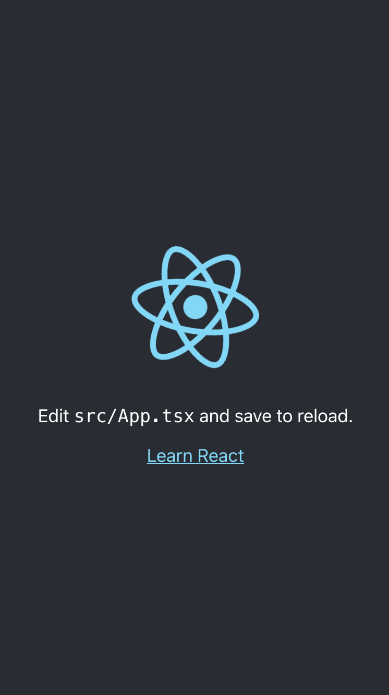
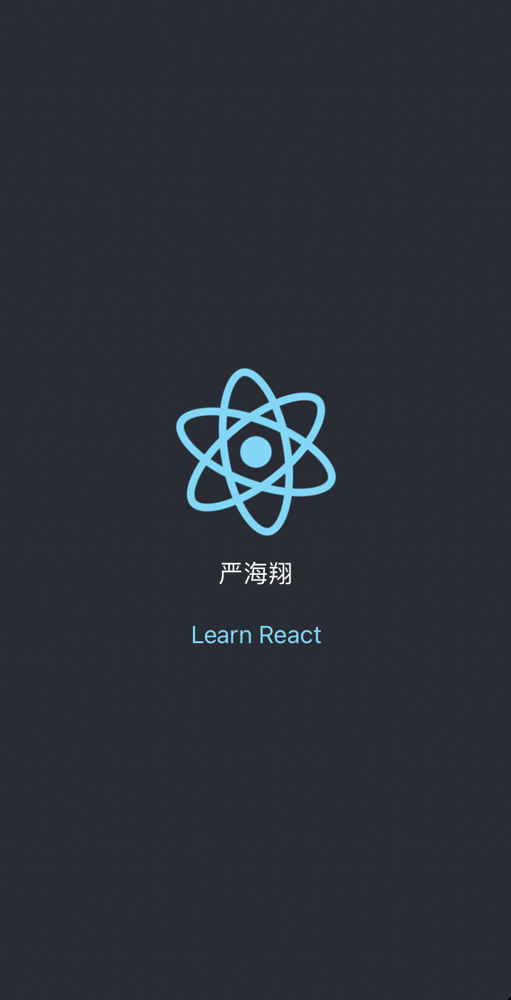

# React 子应用

此项目为当前 `wecom-sidebar-qiankun-tpl` 的微应用，通过 [create-react-app](https://create-react-app.dev/) 脚手架创建。

## 效果

当该项目独立跑的时候，不会接收到 `user` 对象，会展示成最原始的模样。



当该项目作为微应用跑的时候，会从主应用里获取 `user` 对象，会展示当前用户的名字。



## 启动

```shell
npm run start
```
