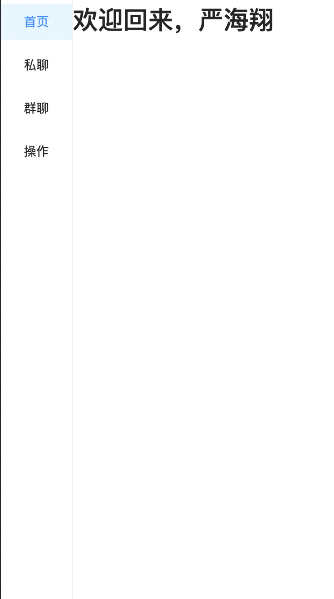
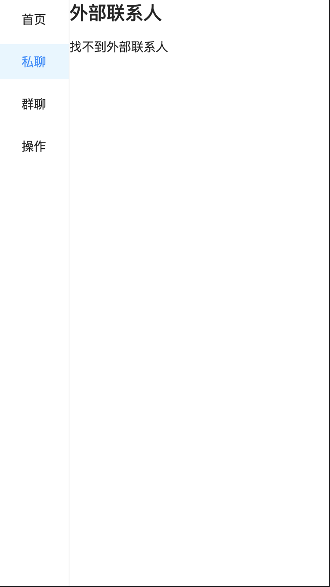
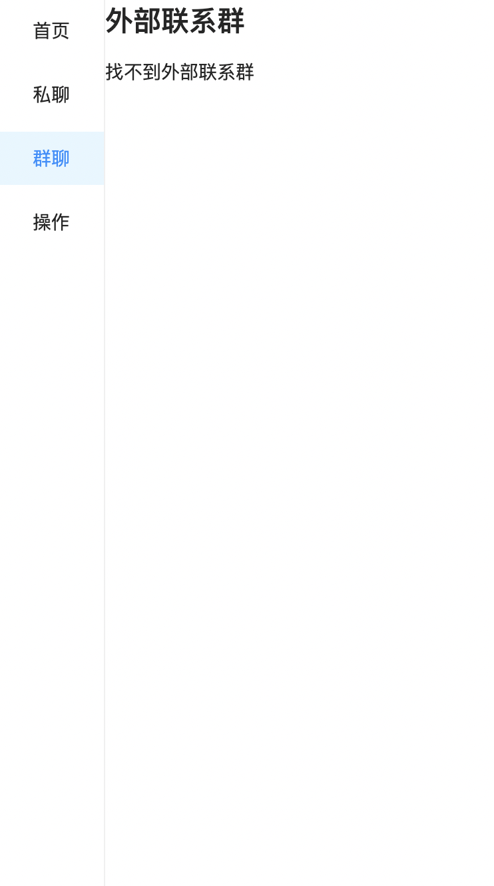
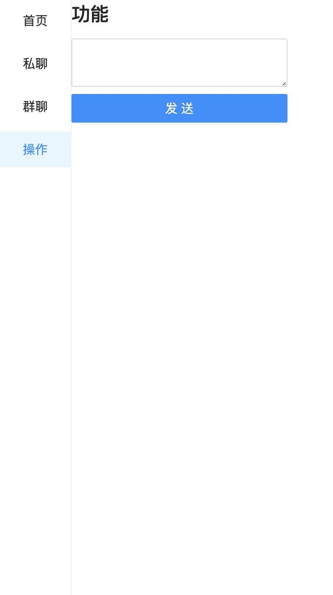

# 侧边栏微应用

此项目为当前 `wecom-sidebar-qiankun-tpl` 的微应用，通过 [create-react-app](https://create-react-app.dev/) 脚手架创建。

## 启动

```shell
npm run start
```

## 内容

本项目可以独立运行，也可以作为 `wescom-sidebar-qiankun-tpl` 的微应用。它拥有如下重要组件：

* Home 
* ExternalUser
* ExternalChat
* Action

### Home
首页，查看当前用户(user)的内容



### ExternalUser
查看外部联系人(external user)内容，主要调用下面 API 获取外部联系人 Id。

```ts
await jsSdk.invoke<{ userId?: string }>('getCurExternalContact', {})
```



### ExternalChat
查看外部联系群(external chat)内容，主要调用下面 API 获取外部联系群 Id。

```ts
await jsSdk.invoke<{ chatId?: string }>('getCurExternalChat', {})
```



### Action
可以发消息，将消息分享到聊天窗口，主要调用下面 API 分享消息。

```ts
await jsSdk.invoke('sendChatMessage', {
  msgtype: 'text',
  text: {
    content: msg
  }
});
```



## 与主应用通信

在项目的入口 [index.tsx](./src/index.tsx) 中，添加了与主应用的通信，可以获取主应用的 `JsSdk`，
并将其透传到 redux 的 store 中，在组件内再获取 `JsSdk` 再与企业微信侧边栏进行交互。

JsSdk 流动为：

```
主应用 -> 微应用(sidebar-app) -> redux store -> 具体组件 -> jsSdk.invoke('xxx')
```

如果要独立运行该项目，你可能无法使用 `JsSdk`，目前我想到比较好的解决方案是在 `createStore` 的初始值里添加 Mock：

```ts
export interface GlobalState {
  jsSdk: any;
}

// 初始全局状态（当独立运行项目时，可以 Mock 此 state）
const initState: GlobalState = {
  jsSdk: {
    invoke: () => console.log('我是 Mock 的 JsSdk')
  }, // 这这里写上你的 Mock JsSdk
}

// 全局状态的 reducer
const reducer: Reducer = (state = initState, action) => {
  switch (action.type) {
    case 'SET_JSSDK': // 当作为微应用 mount 时，会从主应用获取 JsSdk
      return {...state, jsSdk: action.payload}
    default:
      return state;
  }
}

// 创建 redux 的 store
const store = createStore(reducer, initState);
```
